```{r setup, echo=FALSE, message=FALSE, warning=FALSE}
knitr::opts_chunk$set(fig.align='center', fig.height=3)
library(tidyverse)
library(ggplot2)
library(peaktheme)
library(knitr)
```

# Hello & Welcome

Welcome. This document is designed to be an introduction to RMarkdown for Peak and is intended for users who are at least somewhat familiar with the R language. We will not delve too deeply into the R language itself but rather concentrate on a method for producing reports and running R within the report itself to get outputs.

R Markdown is a format for writing reproducible, dynamic reports with R. Use it to embed R code and results into slideshows, pdfs, html documents, Word files and more. Here at Peak, we mainly use it for PDFs but will expand to other formats in the future.


## Creating a Brand New RMarkdown File

Here at Peak we have created a template to get you started for a RMarkdown document. Follow the instructions below to create your new Insight Report.

```
File -> New File -> R Markdown -> From Template -> Insight Report (PDF)
```

Give your report a name and specify the location.

\textcolor{purple}{Tip: Avoid the use of spaces in file names. There are extra things to remember when using the terminal to account for spaces in files.} 

You should now have a Rmarkdown file!

There should be a resources file created from the template that contains two files. 

+ insightreport.tex and
+ peak-logo.png

However, you may not initially be able to see the contents of the folder when you navigate to it. If this is the case then you must first update the permissions associated with the folder. From the terminal navigate to the folder and run the following command:

```
chmod +rwx resources
```

This command gives read, write and execute permissions to the resources folder.

### Knitting

Knitting is the term used for the process in which your document is converted into your output format. In most cases this will be a PDF output so we will concentrate on that only.

In order to knit into a PDF, it uses LaTeX. LaTeX is a system system designed for the production of technical and scientific documentation. However, it does not come preinstalled. To install LaTeX, you must run in the terminal:

```
sudo tlmgr option repository ftp://tug.org/historic/systems/texlive/2019/tlnet-final
sudo tlmgr update --self
sudo tlmgr install xltxtra realscripts xcolor sectsty fancyhdr ulem

```

To execute a Knit press the Knit button as below.

```{r, echo=FALSE, out.width = "40%"}
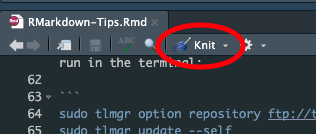
```


\textcolor{purple}{Tip: When knitting a PDF, the process of assembling into a PDF via LaTeX occurs at the END. So if you haven’t run the above, you may wait a long time for your code to run only for it to fall down at the very last moment.}

Make sure that you have modified the permissions for the resource folder otherwise you will get an error along the lines of 
```
Unable to load picture or PDF file 'resources/peak-logo.png'
```

## Markdown Basics

There are two main inputs in an RMarkdown document; Markdown and R code. Markdown makes up the main body of text for the document and can be formatted using various syntax. I have provided some basic Markdown syntax below:

Input  | Output
------------------------------------------------ | ------------------------------------------------
\*italics\* & \_italics\_  | *italics*
\_\_bold\_\_ & \*\*bold\*\* | **bold**
superscript\^2\^ | superscript^2^ 
\~\~strikethrough\~\~ | ~~strikethrough~~ 

Click [here](https://rmarkdown.rstudio.com/authoring_basics.html) for more.

\textcolor{purple}{Tip: The headers will allow for easier navigation in your report and allow for nesting depending on the header type.}


```{r, echo=FALSE, out.width = "40%"}
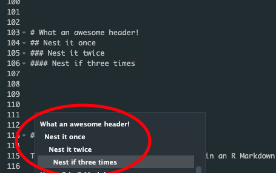
```


# Using R in R Markdown

There are two main ways of using R code in an R Markdown document; an **R Code Chunk** and **R Inline Code**.

## R Code Chunk

To insert a R code chunk click in the insert icon and choose R


```{r, echo=FALSE, out.width = "40%"}
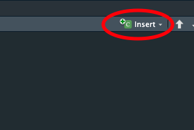
```

To execute a R code chunk click on the green "play" button

```{r, echo=FALSE, out.width = "50%"}
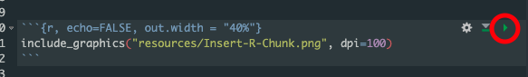
```

When code is executed in the notebook, its output appears beneath the code chunk that produced it. You can clear an individual chunk’s output by clicking the X button in the upper right corner of the output, or collapse it by clicking the chevron.

```{r, echo=FALSE, out.width = "50%"}
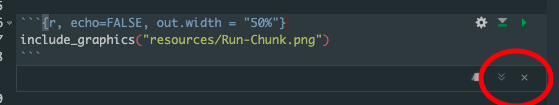
```

\textcolor{purple}{Tip: In the event that the desired output does not appear below the chunk, make sure the option for inline output is enabled. See below.}

```{r, echo=FALSE, out.width = "40%"}
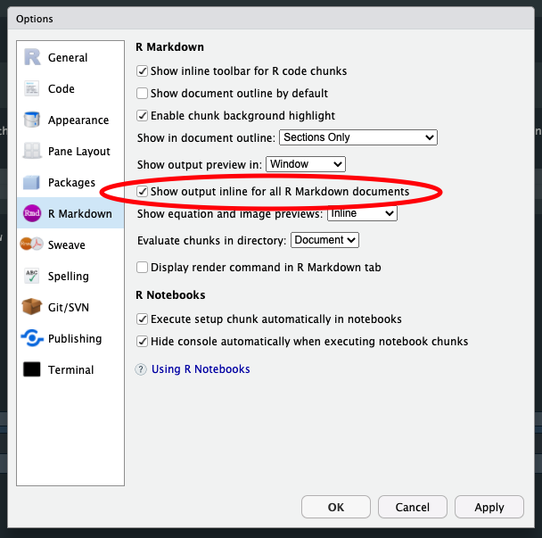
```


\textcolor{purple}{Tip: There is a special chunk called ‘setup’. When you’re in a notebook mode, the chunk named setup will be run automatically once, before any other code is run. Be careful of a massive setup chunk and accidentally running it!}


### Large Chunks

Often there is a lot of processing that happens in a R code chunk but it also might not be required to run every time you want a fresh knit. To bypass this you can add the following option into the R code chunk to cache results.

```
cache=TRUE, cache.lazy=FALSE
```

```{r, echo=FALSE, out.width = "50%"}
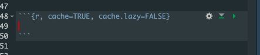
```

Upon first knit of the Markdown document it will load the result of the chunk into cache and next time it knits it will use the result from the cache instead of running again. Notice the cache files in the file explorer. 

```{r, echo=FALSE, out.width = "40%"}
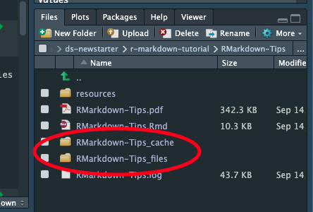
```

You can manually clear the cache by deleting the folders or using the knit options.

```{r, echo=FALSE, out.width = "40%"}
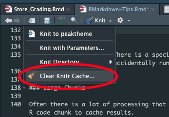
```


Try the below with and without the options.

```{r,eval=FALSE}
Sys.sleep(30)
```


### Chunk Names

You can optionally name the chunks allowing for easier navigation.

```{r, echo=FALSE, out.width = "40%"}
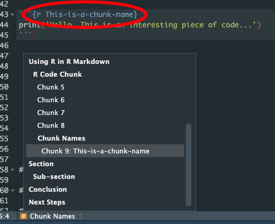
```

Things to look out for when naming chunks:

* Duplicate chunk names will cause failures in knitting
* Trailing blanks in chunk names can sometimes (but not always) cause failures in knitting
* Best practice is to not include spaces or underscores in names


### Chunk Outputs - A note about caching and Dbplyr

Dbplyr does not allow joining of data from Redshift to a local dataframe in a join unless the option 
```
copy = TRUE
```
is explicitly specified. For example

```{r, eval=FALSE}
df %>%
  left_join(df2, by=c('id'), copy = TRUE)
```

This runs successfully when running R code but knitting in an Rmarkdown causes issues with temp tables and thus causes failures. It is therefore advised to avoid this method.

\newpage

### Displaying Figures

Any plot outputs can be displayed in the R code chunk. An example is given below

```{r, dpi=300, fig.retina=1, fig.height=3, fig.align='center'}
data(iris)
ggplot(data = iris, aes(x = Sepal.Length, y = Sepal.Width)) +
  geom_point()
```

\textcolor{purple}{Tip: The option for fig.height can be adjusted. Default is 7 (if you don’t specify) but usually for Peak we use 3 or 3.5. Here at Peak we also centre plots (see screenshot). }

```{r, echo=FALSE, out.width = "40%"}
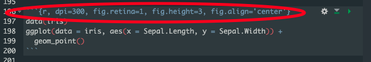
```

\textcolor{purple}{To set this as default add the below to your first/setup chunk. You can use this to set any other options as default also.}

```
knitr::opts_chunk$set(fig.align='center', fig.height=3)
```

### More Chunk Options

Chunk output can be customized with knitr options, arguments set in the \{\} of a chunk header.

* `echo = FALSE` prevents code, but not the results from appearing in the finished file. This is a useful way to embed figures.
* `message = FALSE` prevents messages that are generated by code from appearing in the finished file.
* `warning = FALSE` prevents warnings that are generated by code from appearing in the finished file.
* `dpi = 300` is the number for knitr to use as the dots per inch (dpi) in graphics (when applicable).

A full list of options is available [here](https://www.rstudio.com/wp-content/uploads/2015/03/rmarkdown-reference.pdf?_ga=2.206784467.1103304249.1626685745-1827789065.1622121810).

### Displaying Tables

Any dataframes can be displayed using kable. For an example see the below:

``` {r, dpi=300, fig.retina=1, message=FALSE, warning=FALSE}
knitr::kable(head(iris),
             col.names=c('Sepal Length','Sepal Width', 'Petal Length', 'Petal Width', 'Species'),
             caption = "Iris Data",
             align='c')
```

## R Inline Code

Sometimes you might want to include some code to be executed and the results to be displayed within a sentence. This is when you would use R inlide code. For example:

``` {r, eval=FALSE}
This is a random number between 5 and 7.5: `r runif(1, 5.0, 7.5)`
This is another random number between 5 and 7.5: `r runif(1, 5.0, 7.5)`
```
gives

This is a random number between 5 and 7.5: `r runif(1, 5.0, 7.5)`

This is another random number between 5 and 7.5: `r runif(1, 5.0, 7.5)`

\textcolor{purple}{Tip: When querying a dataframe and the results return something with 0 rows. Once knitted it will display}

\textcolor{purple}{`r iris %>% filter(Species == 'none') %>% select(Species)`}

\textcolor{purple}{or something similar.}

# Bonus: SQL Code Chunk

It may be the case that SQL queries submitted to Redshift may be quicker than loading data into an R workspace and performing data transformations or perhaps certain functions are available in SQL and not R. If desired you can run SQL code within an SQL code chunk. To insert an SQL code chunk click on the insert button and select SQL.

```{r, echo=FALSE, out.width = "40%"}
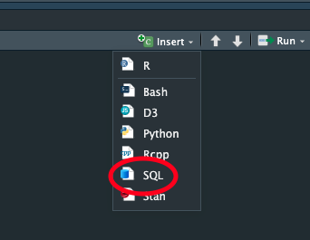
```

The below runs sets up a connection to the newstarter-prod database, then runs the SQL code and outputs the results into a dataframe *my_data*. 

```{r, eval=FALSE}
library(odbc) # Set up connection

con <- dbConnect(odbc::odbc(), "newstarter-prod", bigint = "integer") # Set up connection
```

```{sql, connection = 'con', output.var = 'my_data', eval=FALSE}
#```{sql, connection = 'con', output.var = 'my_data'}
select 1 + 1 as test
   UNION
select 2 + 2 as test
#```
```


